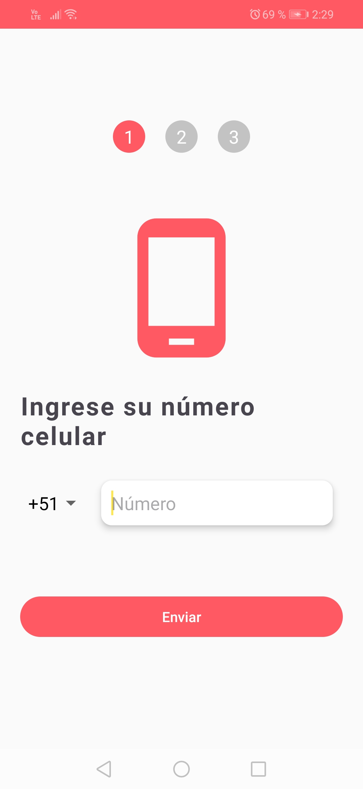
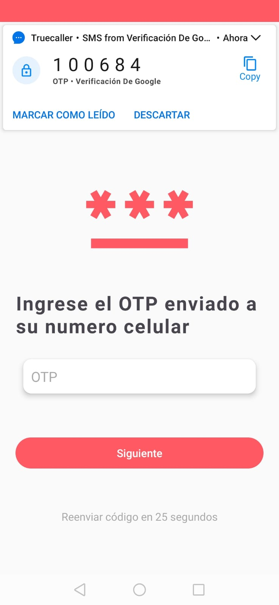
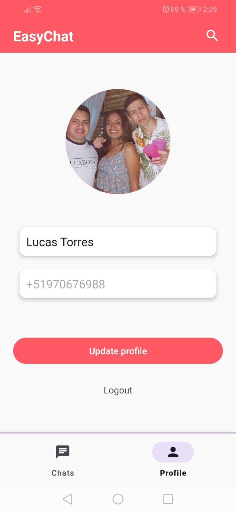

# App-Easy-Chat
Aplicacíon de chat usando las herramientas de Firebase.
Se usó Firebase Authentication para la autenticación por el número celular. Firebase Firestore como base de datos NoSQL, Firebase Storage para almacenar las imagenes y 
Firebase Cloud Messaging (FCM) para las notificaciones. 

  
  
  
  
  

